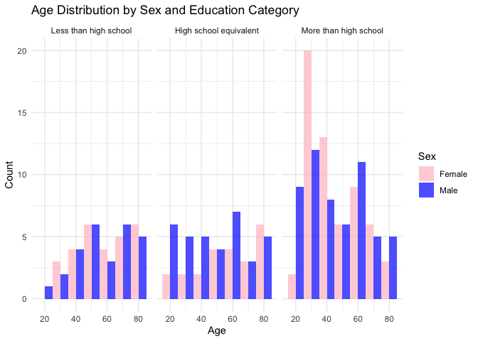
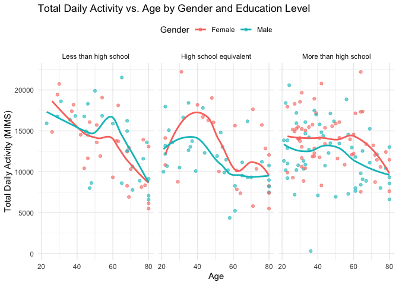
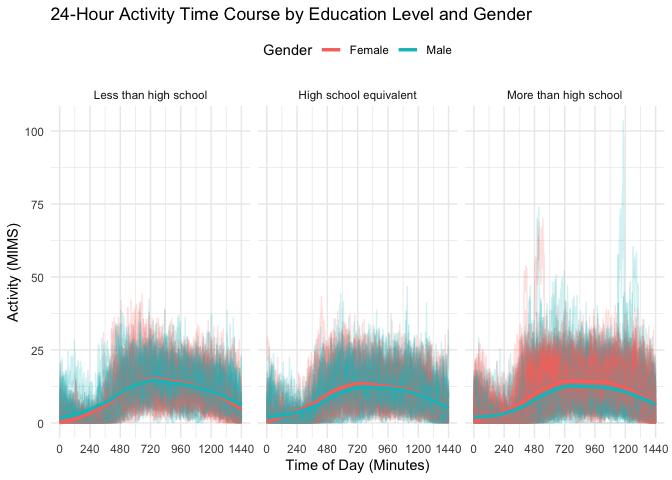
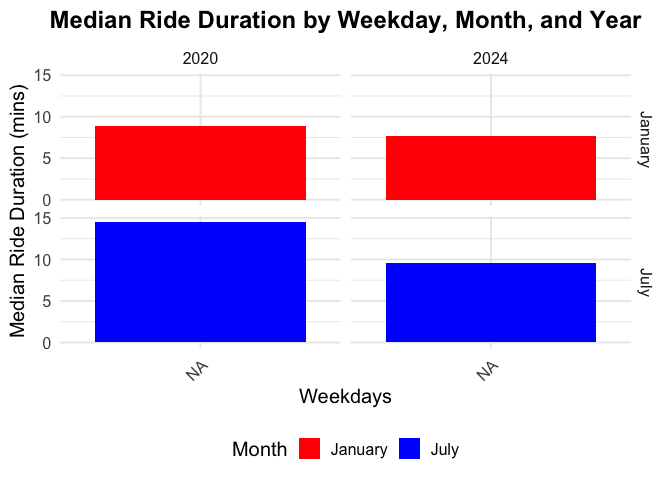
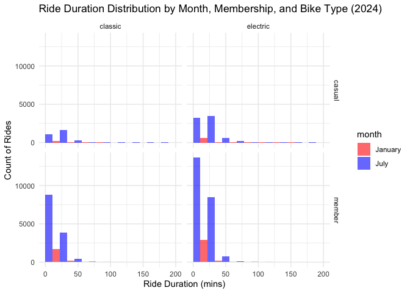

p8105_hw3_rkk2139
================
Riya Kalra

``` r
library(p8105.datasets)
library(ggplot2)
library(dplyr)
```

    ## 
    ## Attaching package: 'dplyr'

    ## The following objects are masked from 'package:stats':
    ## 
    ##     filter, lag

    ## The following objects are masked from 'package:base':
    ## 
    ##     intersect, setdiff, setequal, union

``` r
library(tidyverse)
```

    ## ── Attaching core tidyverse packages ──────────────────────── tidyverse 2.0.0 ──
    ## ✔ forcats   1.0.0     ✔ stringr   1.5.1
    ## ✔ lubridate 1.9.3     ✔ tibble    3.2.1
    ## ✔ purrr     1.0.2     ✔ tidyr     1.3.1
    ## ✔ readr     2.1.5

    ## ── Conflicts ────────────────────────────────────────── tidyverse_conflicts() ──
    ## ✖ dplyr::filter() masks stats::filter()
    ## ✖ dplyr::lag()    masks stats::lag()
    ## ℹ Use the conflicted package (<http://conflicted.r-lib.org/>) to force all conflicts to become errors

``` r
library(tidyr)

#Load datasets
accel_df <- read_csv("https://p8105.com/data/nhanes_accel.csv", skip = 1 )
```

    ## New names:
    ## Rows: 249 Columns: 1441
    ## ── Column specification
    ## ──────────────────────────────────────────────────────── Delimiter: "," dbl
    ## (1441): 62161, 1.106, 3.1151666666666666, 1.4675, 0.9376666666666665, 1....
    ## ℹ Use `spec()` to retrieve the full column specification for this data. ℹ
    ## Specify the column types or set `show_col_types = FALSE` to quiet this message.
    ## • `0.037` -> `0.037...15`
    ## • `0.045500000000000006` -> `0.045500000000000006...51`
    ## • `0.03766666666666667` -> `0.03766666666666667...67`
    ## • `0.05433333333333334` -> `0.05433333333333334...73`
    ## • `0.11933333333333333` -> `0.11933333333333333...110`
    ## • `0.05616666666666666` -> `0.05616666666666666...122`
    ## • `0.051333333333333335` -> `0.051333333333333335...124`
    ## • `0.05883333333333334` -> `0.05883333333333334...128`
    ## • `0.042833333333333334` -> `0.042833333333333334...131`
    ## • `0.043666666666666666` -> `0.043666666666666666...137`
    ## • `0.05883333333333334` -> `0.05883333333333334...159`
    ## • `0.03166666666666667` -> `0.03166666666666667...172`
    ## • `0.051333333333333335` -> `0.051333333333333335...202`
    ## • `0.030500000000000003` -> `0.030500000000000003...204`
    ## • `0.055` -> `0.055...206`
    ## • `0.06666666666666667` -> `0.06666666666666667...210`
    ## • `0.045500000000000006` -> `0.045500000000000006...213`
    ## • `0.055` -> `0.055...216`
    ## • `0.05616666666666666` -> `0.05616666666666666...238`
    ## • `0.0345` -> `0.0345...247`
    ## • `0.025833333333333333` -> `0.025833333333333333...260`
    ## • `0.025833333333333333` -> `0.025833333333333333...273`
    ## • `0.9126666666666666` -> `0.9126666666666666...274`
    ## • `0.037` -> `0.037...281`
    ## • `0.03766666666666667` -> `0.03766666666666667...296`
    ## • `0.11933333333333333` -> `0.11933333333333333...303`
    ## • `0.05433333333333334` -> `0.05433333333333334...312`
    ## • `0.043666666666666666` -> `0.043666666666666666...336`
    ## • `0.03166666666666667` -> `0.03166666666666667...337`
    ## • `0.17700000000000002` -> `0.17700000000000002...341`
    ## • `0.9126666666666666` -> `0.9126666666666666...344`
    ## • `0.042833333333333334` -> `0.042833333333333334...346`
    ## • `15.020499999999998` -> `15.020499999999998...567`
    ## • `5.7046666666666654` -> `5.7046666666666654...724`
    ## • `12.540333333333335` -> `12.540333333333335...733`
    ## • `12.540333333333335` -> `12.540333333333335...854`
    ## • `15.020499999999998` -> `15.020499999999998...1156`
    ## • `11.463833333333334` -> `11.463833333333334...1199`
    ## • `11.463833333333334` -> `11.463833333333334...1201`
    ## • `5.7046666666666654` -> `5.7046666666666654...1325`
    ## • `0.17700000000000002` -> `0.17700000000000002...1356`
    ## • `0.030500000000000003` -> `0.030500000000000003...1369`
    ## • `0.052333333333333336` -> `0.052333333333333336...1375`
    ## • `0.03166666666666667` -> `0.03166666666666667...1377`
    ## • `0.0345` -> `0.0345...1378`
    ## • `0.052333333333333336` -> `0.052333333333333336...1398`
    ## • `0.06666666666666667` -> `0.06666666666666667...1428`

``` r
# Import and clean accel.csv
accel_df =
  read_csv ("https://p8105.com/data/nhanes_accel.csv") |>
  janitor::clean_names () |> 
  pivot_longer (
    min1:min1440,
    names_to = "minute_interval",
    names_prefix = "min",
    values_to = "mims"
  ) |> 
  mutate(minute_interval = as.numeric(minute_interval))
```

    ## Rows: 250 Columns: 1441
    ## ── Column specification ────────────────────────────────────────────────────────
    ## Delimiter: ","
    ## dbl (1441): SEQN, min1, min2, min3, min4, min5, min6, min7, min8, min9, min1...
    ## 
    ## ℹ Use `spec()` to retrieve the full column specification for this data.
    ## ℹ Specify the column types or set `show_col_types = FALSE` to quiet this message.

``` r
covar_df =
  read_csv ("https://p8105.com/data/nhanes_covar.csv", skip = 4) |> # skip first 4 rows
  janitor::clean_names() |>
  drop_na(sex, age, bmi, education) |> 
  filter(!(age < 21)) |> # filter out people younger than 21
  mutate (
    # encode variable with reasonable names
    sex = case_match (sex, 1 ~ "Male", 2 ~ "Female"),
    education = case_match(
      education,
      1 ~ "Less than high school",
      2 ~ "High school equivalent",
      3 ~ "More than high school"
    ),
    education = factor(
      education,
      levels = c(
        "Less than high school",
        "High school equivalent",
        "More than high school"
      )
    )
  )
```

    ## Rows: 250 Columns: 5
    ## ── Column specification ────────────────────────────────────────────────────────
    ## Delimiter: ","
    ## dbl (5): SEQN, sex, age, BMI, education
    ## 
    ## ℹ Use `spec()` to retrieve the full column specification for this data.
    ## ℹ Specify the column types or set `show_col_types = FALSE` to quiet this message.

``` r
merged_df <- accel_df |> 
  left_join(covar_df, by = "seqn")
```

``` r
# Create summary table of the number of men and women in each education category
education_sex_table <- covar_df |> 
  group_by(sex, education) |> 
  summarize(count = n(), .groups = "drop") |> 
  pivot_wider(names_from = sex, values_from = count) |> 
  arrange(education)

# Print the table in a reader-friendly format
education_sex_table |> 
  knitr::kable(
    col.names = c("Education Level", "Female", "Male"),
    caption = "Number of Men and Women in Each Education Category"
)
```

| Education Level        | Female | Male |
|:-----------------------|-------:|-----:|
| Less than high school  |     28 |   27 |
| High school equivalent |     23 |   35 |
| More than high school  |     59 |   56 |

Number of Men and Women in Each Education Category

``` r
# Make histogram for age distribution
age_distribution_histogram <- covar_df |> 
  ggplot(aes(x = age, fill = sex)) + 
  geom_histogram(binwidth = 10, position = "dodge", alpha = 0.7) + 
  facet_grid(. ~ education) +  # Create separate panels for each education level
  labs(
    title = "Age Distribution by Sex and Education Category",
    x = "Age",
    y = "Count",
    fill = "Sex"
  ) + 
  theme_minimal() + 
  scale_fill_manual(values = c("Male" = "blue", "Female" = "pink"))

# Print the plot
print(age_distribution_histogram)
```

<!-- -->

``` r
# Aggregate accelerometer data by participant to get total daily activity
total_activity_df <- accel_df |> 
  group_by(seqn) |> 
  summarize(total_activity = sum(mims, na.rm = TRUE))  # Total activity for each participant

# Merge with the demographic data (covar_df)
merged_df <- total_activity_df |> 
  inner_join(covar_df, by = "seqn")  # Join on 'seqn' (participant ID)

# Plot total activity against age, comparing men and women, and facet by education
ggplot(merged_df, aes(x = age, y = total_activity, color = sex)) +
  geom_point(alpha = 0.6) +  # Scatter plot with some transparency for readability
  geom_smooth(method = "loess", se = FALSE) +  # Add a smooth trend line
  facet_wrap(~education) +  # Separate panels for each education level
  labs(
    title = "Total Daily Activity vs. Age by Gender and Education Level",
    x = "Age",
    y = "Total Daily Activity (MIMS)",
    color = "Gender"
  ) +
  theme_minimal() +  # Clean theme for readability
  theme(legend.position = "top")  # Move the legend to the top
```

    ## `geom_smooth()` using formula = 'y ~ x'

<!-- -->

``` r
# Merge accelerometer data with demographic data (for sex and education)
merged_df <- accel_df |> 
  inner_join(covar_df, by = "seqn")  # Join on 'seqn' (participant ID)

# Plot 24-hour activity time course for each education level, with color by sex, and x-axis in minutes
ggplot(merged_df, aes(x = minute_interval, y = mims, color = sex, group = seqn)) +
  geom_line(alpha = 0.2) +  # Light lines for individual participants' activity
  geom_smooth(aes(group = sex), method = "loess", se = FALSE, size = 1.2) +  # Smooth trends for each sex
  facet_wrap(~education, nrow = 1) +  # Three panels side by side for each education level
  scale_x_continuous(
    breaks = seq(0, 1440, by = 240),  # Label major time points in minutes
    labels = seq(0, 1440, by = 240)  # Use minute intervals as labels
  ) +
  labs(
    title = "24-Hour Activity Time Course by Education Level and Gender",
    x = "Time of Day (Minutes)",
    y = "Activity (MIMS)",
    color = "Gender"
  ) +
  theme_minimal() +
  theme(legend.position = "top")  # Position the legend at the top
```

    ## Warning: Using `size` aesthetic for lines was deprecated in ggplot2 3.4.0.
    ## ℹ Please use `linewidth` instead.
    ## This warning is displayed once every 8 hours.
    ## Call `lifecycle::last_lifecycle_warnings()` to see where this warning was
    ## generated.

    ## `geom_smooth()` using formula = 'y ~ x'

<!-- -->

\#Problem 3

``` r
# Load and clean data
jan_2020 <- read.csv("data/citibike/Jan 2020 Citi.csv") %>%
  janitor::clean_names() %>%
  drop_na(start_station_name, end_station_name) %>%
  mutate(month = "January", year = 2020)

july_2020 <- read.csv("data/citibike/July 2020 Citi.csv") %>%
  janitor::clean_names() %>%
  drop_na(start_station_name, end_station_name) %>%
  mutate(month = "July", year = 2020)

jan_2024 <- read.csv("data/citibike/Jan 2024 Citi.csv") %>%
  janitor::clean_names() %>%
  drop_na(start_station_name, end_station_name) %>%
  mutate(month = "January", year = 2024)

july_2024 <- read.csv("data/citibike/July 2024 Citi.csv") %>%
  janitor::clean_names() %>%
  drop_na(start_station_name, end_station_name) %>%
  mutate(month = "July", year = 2024)

# Combine datasets
citi_bike_data <- bind_rows(jan_2020, july_2020, jan_2024, july_2024)
```

``` r
# Summary of total rides by year and month, separating casual and member riders
citi_bike_data %>%
  group_by(year, month, member_casual) %>%
  summarise(total_rides = n()) %>%
  pivot_wider(names_from = member_casual, values_from = total_rides, values_fill = 0) |>
  knitr::kable()
```

    ## `summarise()` has grouped output by 'year', 'month'. You can override using the
    ## `.groups` argument.

| year | month   | casual | member |
|-----:|:--------|-------:|-------:|
| 2020 | January |    984 |  11436 |
| 2020 | July    |   5637 |  15411 |
| 2024 | January |   2108 |  16753 |
| 2024 | July    |  10894 |  36262 |

``` r
#NOT KNITTING ON LOCAL MACHINE
# Clean the data
citi_bike_data <- citi_bike_data %>%
  mutate(weekdays = weekdays(as.Date(ride_id, format="%Y-%m-%d")),
         rideable_type = tolower(rideable_type))

# Step 1: Find the 5 most popular starting stations for July 2024
july_2024_data <- filter(citi_bike_data, year == 2024 & month == "July")

#popular stations
july_2024_data %>%
  count(start_station_name, sort = TRUE) %>%
  top_n(5) %>%
  rename(Number_of_Rides = n, Station_Name = start_station_name) |>
  knitr::kable(caption = "Top 5 Most Popular Starting Stations for July 2024")
```

    ## Selecting by n

| Station_Name             | Number_of_Rides |
|:-------------------------|----------------:|
| Pier 61 at Chelsea Piers |             163 |
| University Pl & E 14 St  |             155 |
| W 21 St & 6 Ave          |             152 |
| West St & Chambers St    |             150 |
| W 31 St & 7 Ave          |             145 |

Top 5 Most Popular Starting Stations for July 2024

``` r
# Calculate median ride duration
median_duration_df <- citi_bike_data %>%
  group_by(year, month, weekdays) %>%
  summarize(median_duration = median(duration, na.rm = TRUE))
```

    ## `summarise()` has grouped output by 'year', 'month'. You can override using the
    ## `.groups` argument.

``` r
# Order weekdays
weekday_levels <- c("Monday", "Tuesday", "Wednesday", "Thursday", "Friday", "Saturday", "Sunday")
median_duration_df$weekdays <- factor(median_duration_df$weekdays, levels = weekday_levels)

# Plotting median ride duration
ggplot(median_duration_df, aes(x = weekdays, y = median_duration, fill = month)) +
  geom_col(position = "dodge") +
  facet_grid(month ~ year) +
  labs(
    x = "Weekdays",
    y = "Median Ride Duration (mins)",
    fill = "Month",
    title = "Median Ride Duration by Weekday, Month, and Year"
  ) +
  theme_minimal(base_size = 15) +
  scale_fill_manual(values = c("January" = "red", "July" = "blue")) +
  theme(
    axis.text.x = element_text(angle = 45, hjust = 1),
    legend.position = "bottom",
    plot.title = element_text(hjust = 0.5, size = 18, face = "bold")
  )
```

<!-- -->

``` r
# Step 3: Distribution of Ride Duration by Month, Membership Status, and Bike Type
# Filter for 2024 data
data_2024 <- filter(citi_bike_data, year == 2024)

# Create a new column for bike type
data_2024 <- data_2024 %>%
  mutate(bike_type = ifelse(rideable_type == "classic_bike", "classic", "electric"))

# Plotting ride duration distribution by month, membership, and bike type
ggplot(data_2024, aes(x = duration, fill = month)) +
  geom_histogram(position = "dodge", bins = 10, alpha = 0.6) +
  facet_grid(member_casual ~ bike_type) +
  labs(title = "Ride Duration Distribution by Month, Membership, and Bike Type (2024)",
       x = "Ride Duration (mins)", 
       y = "Count of Rides") +
  scale_x_continuous(limits = c(0, 200)) +
  theme_minimal() +
  scale_fill_manual(values = c("January" = "red", "July" = "blue"))
```

    ## Warning: Removed 17 rows containing non-finite outside the scale range
    ## (`stat_bin()`).

    ## Warning: Removed 8 rows containing missing values or values outside the scale range
    ## (`geom_bar()`).

<!-- -->
